# Execution Plan: Estate Remediation

**PRP**: `docs/plans/prp/estate-remediation.md`
**Generated**: 2026-08-19
**Total Tasks**: 51 (consolidated into 39 execution units by file ownership)
**Execution Groups**: 7
**Sequential estimate**: ~46 agent-hours · **Parallel estimate**: ~11 agent-hours · **76% reduction**

---

## Executive Summary

51 tasks from six council seats, organised into 7 groups by dependency and — critically — by
**file ownership**. The binding constraint is not logic, it is collision: five separate findings all
land in `watchdog.sh`, three in `heartbeat.sh`, four hooks all register in one `settings.json`.

**The parallel-safety rule that governs this entire plan: exactly one task owns each file, for the
whole plan.** Where two findings touch the same file they are consolidated into one execution unit,
even when they are logically unrelated. That is why there are 39 units and not 51.

**Key insights**:
- **Group 0 (3 units)**: irreversible damage and the live `main`-only violation. Parallel, no deps.
- **Group 1 (9 units)**: all-new files. Zero dependencies, zero collisions, maximum fan-out.
- **Group 2 (8 units)**: hot-file surgery. One existing file per agent. Parallel because ownership is exclusive.
- **Group 3 (4 units)**: **SEQUENTIAL** — shared surfaces (`settings.json`, a 463-literal sweep across files Group 2 just edited).
- **Group 4 (8 units)**: corpus. Schema parallel, then data repair sequential behind a backup.
- **Group 5 (7 units)**: CI gates and architecture.
- **Group 6 (4 units)**: product. Different repos entirely — free parallelism.

---

## Task Dependency Graph

```mermaid
graph TD
    U1[U1 T21: fix 3 public profanity artifacts]
    U2[U2 T7: run-from-main wrapper + repoint 5 plists]
    U3[U3 T1: sessions table = owned]

    U4[U4 T2: session-reaper.sh]
    U5[U5 T8: launchd-sweep.sh]
    U6[U6 T15: Stop hook script]
    U7[U7 T16: profanity hook script]
    U8[U8 T17: no-code-in-state hook script]
    U9[U9 T18: adversarial-review hook script]
    U10[U10 T23: reap.sh]
    U11[U11 T30: link_items.py]
    U12[U12 H1: council archive]

    U13[U13 watchdog.sh: T4+T5b+T6+T41]
    U14[U14 T5a: poller-recover.sh]
    U15[U15 restore.sh: T12+T13]
    U16[U16 heartbeat.sh: T11a+T43+T44]
    U17[U17 director-loop.sh: T11b+T14]
    U18[U18 quota-watch.sh: T11c+T40]
    U19[U19 watchdog_notify.py: T38+T39]
    U20[U20 T42: ci_gate.py job-name race]

    U21[U21 T3: session-reaper.plist]
    U22[U22 T20: register hooks in settings.json]
    U23[U23 T9: sessions.conf — 463 literals]
    U24[U24 report scripts: T22+T36+T37]

    U25[U25 T25: provenance column]
    U26[U26 T27: interrogative trigger]
    U27[U27 T26: itemize_prompts deterministic]
    U28[U28 T31: possibility_count]
    U29[U29 T32: wire update_text_clean]
    U30[U30 T28+T29: repair 581+7, drop 1057]

    U31[U31 T33: corpus verbatim CI]
    U32[U32 T34: links CI]
    U33[U33 T35: events consumer + orphan CI]
    U34[U34 T45: zero-importer CI]
    U35[U35 dispatch.sh: T24+T47]
    U36[U36 T49: AGENTS.md refusal invariant]
    U37[U37 T10: test-isolation guard]

    U38[U38 T46: ACP wire-or-delete]
    U39[U39 T48: per-project sessions]
    U40[U40 T50: agent-tui public]
    U41[U41 T51: Phase 4 product commit]

    U3 --> U4
    U2 --> U21
    U4 --> U13
    U3 --> U13
    U4 --> U21
    U13 --> U21
    U6 --> U22
    U7 --> U22
    U8 --> U22
    U9 --> U22
    U13 --> U23
    U16 --> U23
    U17 --> U23
    U18 --> U23
    U8 --> U24
    U21 --> U31
    U25 --> U30
    U26 --> U30
    U27 --> U30
    U11 --> U32
    U23 --> U39
    U22 --> U38

    style U1 fill:#FF6B6B
    style U2 fill:#FF6B6B
    style U3 fill:#FF6B6B
    style U4 fill:#90EE90
    style U5 fill:#90EE90
    style U6 fill:#90EE90
    style U7 fill:#90EE90
    style U8 fill:#90EE90
    style U9 fill:#90EE90
    style U10 fill:#90EE90
    style U11 fill:#90EE90
    style U12 fill:#90EE90
    style U13 fill:#FFD700
    style U14 fill:#FFD700
    style U15 fill:#FFD700
    style U16 fill:#FFD700
    style U17 fill:#FFD700
    style U18 fill:#FFD700
    style U19 fill:#FFD700
    style U20 fill:#FFD700
    style U21 fill:#FFA500
    style U22 fill:#FFA500
    style U23 fill:#FFA500
    style U24 fill:#FFA500
    style U25 fill:#87CEEB
    style U26 fill:#87CEEB
    style U27 fill:#87CEEB
    style U28 fill:#87CEEB
    style U29 fill:#87CEEB
    style U30 fill:#87CEEB
    style U31 fill:#B0A0FF
    style U32 fill:#B0A0FF
    style U33 fill:#B0A0FF
    style U34 fill:#B0A0FF
    style U35 fill:#B0A0FF
    style U36 fill:#B0A0FF
    style U37 fill:#B0A0FF
    style U38 fill:#F5A0D0
    style U39 fill:#F5A0D0
    style U40 fill:#F5A0D0
    style U41 fill:#F5A0D0
```



**Legend**
- 🔴 **Red (Group 0)** — irreversible damage + the live violation. Nothing else starts clean until these do.
- 🟢 **Green (Group 1)** — foundation. All-new files, no dependencies, no collisions.
- 🟡 **Yellow (Group 2)** — hot-file surgery. One existing file per agent, exclusive ownership.
- 🟠 **Orange (Group 3)** — integration. **Sequential.** Shared surfaces.
- 🔵 **Blue (Group 4)** — corpus. Schema parallel, data repair serialized behind a backup.
- 🟣 **Purple (Group 5)** — CI gates and architecture.
- 🌸 **Pink (Group 6)** — product. Separate repos, free parallelism.

---

## THE PARALLEL SAFETY CONTRACT

*This is the part Jon asked for by name: agents working in parallel that do not break or overlap
each other. It is enforced mechanically, not by agents being careful.*

### Rule 1 — Exclusive file ownership, plan-wide

Every file in this plan appears in exactly one unit's **FILES OWNED** list. An agent that needs to
edit a file it does not own **stops and reports**; it does not edit and it does not negotiate. The
manifest is machine-checkable:

```bash
# Fails the plan if any path is claimed twice
grep -h '^- OWNS: ' docs/plans/prp/estate-remediation/execution/execution-plan.md \
  | sort | uniq -d | ifne false
```

This is why `watchdog.sh` is one unit carrying four unrelated findings, and why the 463-literal
`sessions.conf` sweep is alone in its own sequential slot — it touches files six other units own.

### Rule 2 — One worktree per unit, branch per unit

```bash
git worktree add .worktrees/exec/U13-watchdog -b exec/U13-watchdog origin/main
```

Branched from `origin/main`, never from another unit's branch. No unit sees another's uncommitted
work. A unit that needs another's output waits for it to be **merged to main**, which is what the
group boundary means.

### Rule 3 — Group barriers are real

A group's validation gate must pass before the next group's worktrees are created. Within a group
there is no barrier — units finish when they finish. Between groups there is a hard stop, because
the next group branches from a `main` that must contain the previous group's merges.

### Rule 4 — Ledger claim before any file is touched

Each unit claims its ID in the ledger before starting and releases on merge. A second agent finding
the claim held **does not proceed**. This is the existing claim mechanism; the plan does not invent a
new one. (Note the known defect: 16 stale claims had to be released by hand on 2026-08-19 — U13's
watchdog work includes a claim-TTL, so this does not silently deadlock the plan.)

### Rule 5 — Shared-surface files are never parallel

Three surfaces are single-owner-sequential by construction and are named here so nobody rediscovers
it the hard way:
| Surface | Why | Owner |
|---|---|---|
| `~/.claude/settings.json` | one JSON object, four hooks | U22, alone, after U6–U9 merge |
| The five existing `com.jonhill.*` plists | one wrapper change applies to all | U2, alone, Group 0 |
| Session-name literals (463 sites) | rewrites files six units own | U23, alone, Group 3 |

### Rule 6 — The ledger is READ ONLY except for U25–U30

Group 4 owns every write to the corpus. Any other unit that writes to `ledger.sqlite3` is a plan
violation. Group 4's data repair (U30) runs **only** after a verified backup, under the
`safe-deletion` skill — it deletes 1,057 rows and rewrites 588 more of Jon's corpus.

---

## Execution Groups

### Group 0: Stop the Bleeding (PARALLEL — 3 units)

**Execution Mode**: PARALLEL · **Dependencies**: none · **Duration**: ~45 min

| Unit | Task | OWNS | Why it is first |
|---|---|---|---|
| **U1** | T21 — edit `agent-dotfiles` #237, #174, PR #55 | *(GitHub API only — no repo files)* | The only damage in the whole plan that is already public and cannot be undone by a later fix. |
| **U2** | T7 — `run-from-main.sh` + repoint 5 plists onto `$SUPERVISOR_LIVE` | `scripts/hooks/run-from-main.sh`, `~/Library/LaunchAgents/com.jonhill.{director-loop,supervisor-watchdog,heartbeat,quota-watch,inbox-poll}.plist` | S2 is **violated right now** — four jobs run from a checkout 4 commits off `main`. Every later unit deploys through `live/`; this must be true first. |
| **U3** | T1 — `sessions` table: insert the two production sessions, drop three `at14-scratch-*` | `migrations/0NN_sessions_owned.sql`, `scripts/supervisor/sessions.conf` | The whole recovery design is a set-difference against this table. It is currently 3 test scratch sessions and 2 side projects, and contains **neither production session**. |

**Why parallel**: three disjoint surfaces — a remote API, a wrapper + plists, a migration.

**Gate before Group 1**:
```bash
gh issue view 237 --repo jonhill90/agent-dotfiles --json body -q .body | grep -icE '<profanity-list>' # expect 0
gh issue view 174 --repo jonhill90/agent-dotfiles --json body -q .body | grep -icE '<profanity-list>' # expect 0
gh pr   view 55  --repo jonhill90/agent-dotfiles --json body -q .body | grep -icE '<profanity-list>' # expect 0
for p in ~/Library/LaunchAgents/com.jonhill.*.plist; do
  /usr/libexec/PlistBuddy -c 'Print :ProgramArguments:0' "$p"; done | grep -c "$SUPERVISOR_LIVE"   # expect 5
sqlite3 -readonly "$LEDGER" "select name from sessions order by name;"   # expect agent-supervisor, director, + repo sessions; no at14-scratch-*
```

---

### Group 1: Foundation Layer (PARALLEL — 9 units)

**Execution Mode**: PARALLEL · **Dependencies**: Group 0 · **Duration**: ~2h (longest unit)

Every unit here creates **new files only**. Zero collision surface by construction — this is the
maximum-fan-out group and should be dispatched in a single message.

| Unit | Task | OWNS | Complexity |
|---|---|---|---|
| **U4** | T2 — `session-reaper.sh`: set-difference owned-sessions ↔ `tmux ls`, call `bootstrap-session.sh`. **Zero model calls.** | `scripts/supervisor/session-reaper.sh`, `tests/supervisor/test_session_reaper.sh` | High — the load-bearing unit |
| **U5** | T8 — launchd exit sweep, pages on 2 consecutive non-zero | `scripts/supervisor/launchd-sweep.sh`, `~/Library/LaunchAgents/com.jonhill.launchd-sweep.plist`, `tests/supervisor/test_launchd_sweep.sh` | Low |
| **U6** | T15 — S1 Stop hook | `scripts/hooks/check_stop_authorized.sh`, `tests/hooks/test_stop_authorized.sh` | Medium |
| **U7** | T16 — S4 profanity/quote hook | `scripts/hooks/no_quote_profanity.py`, `tests/hooks/test_no_quote_profanity.py` | Low — deterministic, no model |
| **U8** | T17 — S5 no-code-in-state hook | `scripts/hooks/no_code_in_state.py`, `tests/hooks/test_no_code_in_state.py` | Low |
| **U9** | T18 — ASKS gate on merge/push/launchctl | `scripts/hooks/require_adversarial_review.py`, `ASKS.tsv`, `tests/hooks/test_asks_gate.py` | Medium |
| **U10** | T23 — S10 reaper: branch/worktree ceilings, unconditional `git worktree prune` | `scripts/supervisor/reap.sh`, `~/Library/LaunchAgents/com.jonhill.reap.plist`, `tests/supervisor/test_reap.sh` | Medium — deletes things; `safe-deletion` skill applies |
| **U11** | T30 — deterministic `links` comparator | `scripts/supervisor/link_items.py`, `tests/supervisor/test_link_items.py` | Medium |
| **U12** | H1 — council archive, six seats verbatim | `docs/audit/2026-08-19-council/seat-{1..6}-*.md` | Low — pure docs |

**Parallelisation strategy** (his framework's shape, adapted to this estate's dispatcher):
```
dispatch 9 lanes in ONE message, each with:
  - worktree .worktrees/exec/U{N}-{slug} branched from origin/main
  - the PRP + this plan + its own OWNS manifest
  - failing-test-first: the test is written and RED before the implementation
```

**Gate before Group 2**:
```bash
shellcheck scripts/supervisor/session-reaper.sh scripts/supervisor/launchd-sweep.sh \
           scripts/supervisor/reap.sh scripts/hooks/run-from-main.sh
python3 -m unittest discover -s tests -v
# Positive control — the reaper must actually create a session in an isolated server:
TMUX_TMPDIR=$(mktemp -d) bash tests/supervisor/test_session_reaper.sh   # expect PASS
# Mutation check — it must be able to fail:
#   comment out the new-session call, re-run, expect RED, restore.
```

---

### Group 2: Hot-File Surgery (PARALLEL — 8 units)

**Execution Mode**: PARALLEL · **Dependencies**: Groups 0–1 · **Duration**: ~2.5h

Each unit owns **exactly one existing file**. Findings that landed in the same file were merged into
one unit even where unrelated — that consolidation is the reason this group can run in parallel at all.

| Unit | OWNS (one file) | Findings folded in |
|---|---|---|
| **U13** | `scripts/supervisor/watchdog.sh` | **T4** `no_session` → call the reaper, not `exit 0` · **T5b** stop stamping `.poller-recovery-last-success` on a `no_session` tick · **T6** restart-ceiling escalates *and* hands to the reaper; `ESCALATE` unreachable without a rebuild attempt · **T41** health predicate requires `pane_working > 0` or a recorded stand-down · claim-TTL so stale claims cannot deadlock the plan |
| **U14** | `scripts/supervisor/poller-recover.sh` | **T5a** line 155 `exit 0` → `exit 1`; add the missing-session case to `test_poller_recover.sh`, which has **zero coverage for it** today despite 120 lines of header reasoning about eight rarer ones |
| **U15** | `scripts/supervisor/restore.sh` | **T12** split `--session` (redirect, human-only) from `--only-session` (filter, scheduler-safe) · **T13** close #347 for real — place claude-print lanes, and replace the acceptance grep that currently passes against unfixed code |
| **U16** | `scripts/supervisor/heartbeat.sh` | **T11a** target-reachability preflight · **T43** line 197 self-matching nudge verification → `\| tail -1 \|`, the discipline already correct at line 93 · **T44** un-pin `HEARTBEAT_STALE_AFTER=0` so #325's "must NOT nudge a healthy pane" case is reachable |
| **U17** | `scripts/supervisor/director-loop.sh` | **T11b** preflight · **T14** `contest-stop.sh` reachable-or-deleted (today: exits 3 at line 110, so the call at 232 is dead) |
| **U18** | `scripts/supervisor/quota-watch.sh` | **T11c** preflight · **T40** `UNKNOWN`×2 → `UNSAFE`; a real stand-down state; a blind meter halts dispatch |
| **U19** | `scripts/supervisor/watchdog_notify.py` | **T38** parameterize the hardcoded `inbox-poll` message and threshold — every page ever sent named the wrong subsystem · **T39** bound the `state: stopped` staleness exemption in time |
| **U20** | `scripts/supervisor/ci_gate.py` + `.github/workflows/gate-lint.yml` | **T42** rename one of the two `gate:` jobs; add a workflow-lint test forbidding duplicate job names. The merge gate is currently decided by a three-second race |

**Why these can run in parallel**: no two units name the same path; none imports another's changes;
each is verified by its own test.

**Gate before Group 3 — THE ONE THAT MATTERS**:
```bash
python3 -m unittest discover -s tests -v
tmux kill-session -t agent-supervisor
sleep 330
tmux has-session -t agent-supervisor && echo RECOVERED-1
tmux kill-session -t agent-supervisor
sleep 330
tmux has-session -t agent-supervisor && echo RECOVERED-2   # a single pass is a coincidence
```
**If this gate does not pass twice, the plan stops here.** Every later group is polish on a system
that still cannot survive its own death.

---

### Group 3: Integration Layer (SEQUENTIAL — 4 units)

**Execution Mode**: SEQUENTIAL · **Dependencies**: Groups 0–2 · **Duration**: ~2h

These share surfaces. Running them in parallel would produce exactly the collision this plan exists
to prevent.

**3.1 — U21: `com.jonhill.session-reaper.plist`** · StartInterval 300, RunAtLoad true, executed
through U2's wrapper. *Depends on U4 (the script) and U13 (the watchdog branch that calls it).*

**3.2 — U22: register every hook in `~/.claude/settings.json`** · Sole owner of that file, plan-wide.
Adds the `hooks` key that **does not currently exist at all**: `Stop` → U6, `PreToolUse` → U7 + U9,
`PostToolUse` → U8, `SessionStart` → T19 main-ancestry verdict. *Depends on U6–U9 being merged.*

**3.3 — U23: `sessions.conf` sweep — 297 `agent-supervisor` + 166 `director` literals** · Rewrites
files U13/U16/U17/U18 own, which is precisely why it is here and alone. *Depends on all of Group 2
being merged to `main`.*

**3.4 — U24: report scripts** · **T22** move `phase-report.sh` (13,594 bytes, untracked, living only
in `~/.local/state`) into `scripts/supervisor/` · **T36** always send, lead with
`MISS: n/30 (N consecutive)`, three misses page — today it suppresses itself when nothing happened,
which is the exact condition Jon most needs told about · **T37** delete the `NOTIFY-PATH-STALE`
fallback (83 of 119 lines); a stale path exits 1 and pages through the surviving channel.

**Gate before Group 4**:
```bash
python3 -c "import json;d=json.load(open('$HOME/.claude/settings.json'));print(sorted(d['hooks']))"
# expect: PreToolUse, PostToolUse, SessionStart, Stop
grep -rn "'agent-supervisor'\|\"agent-supervisor\"" scripts/ | grep -v sessions.conf | wc -l   # expect 0
comm -13 <(git ls-files | xargs -n1 basename | sort -u) \
         <(find ~/.local/state -maxdepth 3 \( -name '*.sh' -o -name '*.py' \) -exec basename {} \; | sort -u)
# expect empty — no executable in state that is not in git
```

---

### Group 4: Corpus Integrity (MIXED — 6 units)

**Execution Mode**: 4a PARALLEL, then 4b SEQUENTIAL · **Dependencies**: Group 3 · **Duration**: ~2h

> **This group is the only writer to `ledger.sqlite3` in the entire plan.** U30 deletes 1,057 rows and
> rewrites 588 more of Jon's own corpus. It runs under the `safe-deletion` skill, after a verified
> backup, and **not before U25–U27 are merged** — repairing data under a schema that still permits the
> corruption re-creates it.

**4a (parallel — 5 units)**

| Unit | Task | OWNS |
|---|---|---|
| **U25** | T25 — `prompts.provenance` NOT NULL, from `promptSource` | `migrations/0NN_provenance.sql`, ingest path |
| **U26** | T27 — `BEFORE INSERT` trigger: raise on interrogative prompt + `weight='hard'` | `migrations/0NN_no_question_as_decision.sql` |
| **U27** | T26 — `itemize_prompts.py`: `kind`/`weight` deterministic; the model may propose `body` text only | `scripts/supervisor/itemize_prompts.py` |
| **U28** | T31 — `possibility_count` currently returns `COUNT(*) FROM live_parameters WHERE weight='hard'` = 920: a count of his **constraints**, reported under the name of the **solution space**. Rename or compute correctly. | `migrations/0NN_possibility_count.sql`, `scripts/supervisor/cli.py` (view only) |
| **U29** | T32 — wire `update_text_clean`; it has exactly one occurrence in the codebase, its own definition, and 95.1% of rows are untouched | ingest path (`scripts/supervisor/ingest_prompts.py`) |

**4b (sequential — 1 unit)**

**U30** — **T28** repair 581 contaminated hard items + 7 third-person paraphrase rows; re-ingest the
missing messages (all of 08-19, ~22% never ingested; `make me look good` returns **0 rows** — his most
consequential instruction is absent) · **T29** delete the 1,057 rows sourced from `hill90-app`, a repo
he excluded twice.

**Gate before Group 5**:
```bash
sqlite3 -readonly "$LEDGER" "
  select count(*) from items i join prompts p using(prompt_id)
  where p.text_raw like '%?' and i.weight='hard';"        # expect 0
sqlite3 -readonly "$LEDGER" "select count(*) from prompts where provenance is null;"   # expect 0
sqlite3 -readonly "$LEDGER" "select count(*) from prompts where text_raw like '%make me look good%';"  # expect >0
sqlite3 -readonly "$LEDGER" "select count(*) from links;"  # expect >0
```

---

### Group 5: Gates and Architecture (PARALLEL — 7 units)

**Execution Mode**: PARALLEL · **Dependencies**: Group 4 · **Duration**: ~2h

Each unit owns its own new workflow file, so there is no `.github/workflows/ci.yml` contention.

| Unit | Task | OWNS |
|---|---|---|
| **U31** | T33 — corpus verbatim + complete, **both directions**, byte-for-byte against the source `.jsonl` | `.github/workflows/corpus-verbatim.yml`, `scripts/checks/check_corpus_verbatim.py` |
| **U32** | T34 — fail when `items > 500 AND links = 0`; the `conflicts` view has **never been able to fire** | `.github/workflows/corpus-links.yml`, `scripts/checks/check_links_live.py` |
| **U33** | T35 — `events` consumer + orphan test: **703/703 rows never notified, never acked**; only 13.6% of tasks recorded `accepted_at` | `.github/workflows/events-orphan.yml`, `scripts/supervisor/notify_events.py` |
| **U34** | T45 — every module under `scripts/supervisor/` has ≥1 non-test importer. `acp_transport.py` fails today, and the repo says so in two of its own files | `.github/workflows/no-orphan-modules.yml`, `tests/test_no_orphan_modules.py` |
| **U35** | T24 + T47 — flip `--dangerously-skip-permissions` (on **132 lanes**, never asked for) to scoped, bypass recorded per-lane; add `role`/`tier`/`parent_lane` and select by tier, not by freeness | `scripts/supervisor/dispatch.sh`, `migrations/0NN_lane_tier.sql` |
| **U36** | T49 — AGENTS.md invariant: *a refusal-to-act must name what does act instead, or it is a bug.* Grandfather the 43 existing `a human should look` sites **by count**, so the number can only go down | `AGENTS.md`, `tests/test_refusal_has_actuator.sh` |
| **U37** | T10 — test-isolation guard: no fixture may claim a production session name on the default socket (one did, and the production loop ticked it) | `tests/conftest.sh`, `scripts/supervisor/_tmux_guard.sh` |

**Gate before Group 6**: all seven workflows green on a PR, **and** each mutation-verified — revert
the fix, confirm the gate goes red, restore. A gate that cannot fail is the defect this group exists
to remove.

---

### Group 6: Product (PARALLEL — 4 units)

**Execution Mode**: PARALLEL · **Dependencies**: Group 5 (U39 also needs U23) · **Duration**: ~3h

Separate repositories — free parallelism, zero collision.

| Unit | Task | Note |
|---|---|---|
| **U38** | T46 — ACP: one real lane completes one real task on `ACPTransport`, **or the module is deleted**. No third option. | 23 asks across 9 days; `acp` lanes = 0, `pi-rpc` = 0, while 162 lanes ran on a transport nobody asked for |
| **U39** | T48 — per-project tmux sessions restored, held by the owned-sessions table so a crash cannot silently revert them again | Asked 14 times; the mechanism exists and every crash reverted it |
| **U40** | T50 — `agent-tui` → public | One command. Asked 2026-08-19 08:17 |
| **U41** | T51 — Phase 4 interface work: the first product commit since 2026-08-09. Agents drive every control before Jon sees it; he QAs look-and-feel only | **357 machinery PRs, 0 product commits** is the finding this unit answers |

**Final gate**:
```bash
gh repo view jonhill90/agent-tui --json visibility -q .visibility    # expect PUBLIC
git -C ../agent-tui log --oneline origin/main -3                      # expect a commit dated today
tmux kill-session -t agent-supervisor && sleep 330 && tmux has-session -t agent-supervisor
```

---

## Critical Path Analysis

```
U3 (sessions table) → U4 (reaper) → U13 (watchdog no_session branch) → U21 (plist) → KILL TEST
   20 min              90 min          75 min                            15 min       11 min
```
**~3.5 hours to a self-healing estate.** Everything else is off the critical path and runs beside it.

**Longest chain overall**: U3 → U4 → U13 → U23 → U39 → final gate ≈ 7h.
**Sequential total**: ~46h. **Parallel**: ~11h wall-clock at 8-lane concurrency. **76% reduction.**

---

## Risk Assessment

### Bottlenecks

1. **U13 (`watchdog.sh`) carries four findings and is on the critical path.** It is the single largest
   unit and everything downstream waits on it. *Mitigation*: it is dispatched first in Group 2 and
   reviewed by a lane that did not write it, per the estate's own merge policy.
2. **U23's 463-literal sweep is mechanically large and touches four other units' files.** *Mitigation*:
   it is alone in a sequential slot after those units merge; a `grep` count is its acceptance test.
3. **U30 rewrites Jon's corpus.** *Mitigation*: verified backup, `safe-deletion` skill, and it cannot
   start until the schema that permitted the corruption is fixed.
4. **Group 2's kill-test gate can fail.** That is the point. *Mitigation*: the plan **stops** rather
   than proceeding to polish — stated explicitly so nobody rationalises past it.

### What this plan deliberately does NOT do

- **No 25th detector.** 24 exist and all are correct.
- **No louder alerting.** 88 Telegram messages were delivered during the outage.
- **No `restore.sh` automation before U15.** Both current invocations are destructive; dry-run-proven.
- **No lane auto-restart.** Invariant 3 stands. The reaper restores the **session container**, which
  has no context to fake, and nothing more.

### Assumptions

1. **The `sessions` table is the right ownership registry.** It exists (#153) and is currently
   populated with three test scratch sessions and two side projects — neither production session. If
   Jon prefers a flat config file, `sessions.conf` (U3) is already the mirror and can become primary.
2. **`bootstrap-session.sh` is safe to automate.** Dry-run clean, exit 0, creates the session plus nine
   honest `free-N` lanes. **Verified by seat 5, not assumed.**
3. **8-lane concurrency.** Fewer lanes stretches wall-clock but changes no dependency.
4. **The 25-branch / 10-worktree ceilings in U10 are the council's numbers, not Jon's.** He gave the
   direction; he should overrule the figures freely.
