# Execution Plan: Estate Remediation

**PRP**: `prps/estate_remediation.md` (1,949 lines, 35 tasks, self-scored 9/10)
**Generated**: 2026-08-19
**Repo root**: `/Users/jon/source/repos/Personal/agent-supervisor/.worktrees/plan/audit-remediation`
**Total Tasks**: 35
**Execution Groups**: 8 (one solo barrier, six parallel, one closing pair)
**Archon**: NOT AVAILABLE — task state lives in the ledger claim mechanism, not Archon.
**Estimated Time Savings**: **67%** — 1,760 min sequential → **580 min** parallel (3.03x)

---

## Executive Summary

35 tasks, analysed for explicit dependencies, file-set intersection, and the six hard ordering
constraints the PRP established. The binding constraint on parallelism in this plan is **not**
logic — it is **file ownership**, exactly as the PRP's own self-assessment states. The file-conflict
matrix is almost perfectly clean: **of 595 task pairs, exactly one pair intersects** (T8 ∩ T10 = the
six `launchd/com.jonhill.*.plist` files), and that intersection is deliberate serialization, not a
defect.

**Key insights**:

- **T1 is a hard solo barrier.** Nothing else may start. Six later tasks read the ledger and *cannot
  be written* until `snapshot_ledger()` exists — the PRP says so in T1's own RESPONSIBILITY, and
  gotchas Critical 1 proves every naive alternative returns a green gate over an unreadable file.
- **Four independent chains fan out of T1** and run concurrently for the whole plan: the
  **session-recovery chain** (T2/T3 → T4 → T5/T6), the **launchd chain** (T8 → T10 → T9), the
  **hooks chain** (T22 → T23 → T24), and the **corpus chain** (T25 → T26 → T27).
- **Sixteen tasks have no dependency but T1** (or none at all). They are the reason the plan needs
  eight groups rather than five: the framework caps a parallel group at 6, so the wide independent
  tier is split across G5, G6 and G7 rather than fired as one 16-way fan-out.
- **The critical path is 250 minutes** (session recovery). A second chain measures *longer* — see
  "Critical Path Analysis", where that discrepancy is reported rather than smoothed over.

---

## Task Dependency Graph

```mermaid
graph TD
    T1["T1: Credential triage +<br/>ledger-snapshot (BARRIER)"]

    T2["T2: Register owned sessions"]
    T3["T3: bootstrap repairable"]
    T8["T8: Advance live/ + repoint plists"]
    T22["T22: HOOK SPIKE"]
    T25["T25: core.py schema"]

    T4["T4: SESSION REAPER"]
    T10["T10: run-from-main.sh"]
    T23["T23: Four hooks + installer"]
    T26["T26: itemize_prompts"]
    T28["T28: corpus verbatim gate"]
    T29["T29: link comparator"]

    T5["T5: poller-recover exit"]
    T6["T6: watchdog no_session"]
    T9["T9: launchd sweep"]
    T24["T24: 3 public violations"]
    T27["T27: CORPUS REPAIR"]

    T7["T7: restore.sh split"]
    T11["T11: tmux preflight"]
    T12["T12: session literals"]
    T13["T13: test isolation"]
    T14["T14: heartbeat match"]

    T15["T15: merge gate race"]
    T16["T16: module callers"]
    T17["T17: watchdog_notify"]
    T18["T18: events consumed"]
    T30["T30: quota stand-down"]

    T19["T19: report always sends"]
    T20["T20: reap.sh + ceilings"]
    T21["T21: no-code-in-state"]
    T31["T31: dispatch quiesce"]
    T32["T32: refusal actuator"]
    T33["T33: machinery ratio"]

    T34["T34: deferrals + contested"]
    T35["T35: evidence vocabulary"]

    T1 --> T2
    T1 --> T25
    T1 --> T28
    T1 --> T18
    T1 --> T27
    T1 --> T33

    T2 --> T4
    T3 --> T4
    T4 --> T5
    T4 --> T6

    T8 --> T10
    T10 --> T9

    T22 --> T23
    T23 --> T24

    T25 --> T26
    T25 --> T29
    T26 --> T27
    T28 --> T27

    T30 --> T31

    T4 --> T34
    T23 --> T34
    T27 --> T34
    T16 --> T34
    T11 --> T34
    T34 --> T35
    T12 --> T35
    T15 --> T35
    T18 --> T35
    T20 --> T35
    T29 --> T35
    T32 --> T35
    T33 --> T35

    style T1 fill:#FF6B6B,color:#000

    style T2 fill:#90EE90,color:#000
    style T3 fill:#90EE90,color:#000
    style T8 fill:#90EE90,color:#000
    style T22 fill:#90EE90,color:#000
    style T25 fill:#90EE90,color:#000

    style T4 fill:#FFD700,color:#000
    style T10 fill:#FFD700,color:#000
    style T23 fill:#FFD700,color:#000
    style T26 fill:#FFD700,color:#000
    style T28 fill:#FFD700,color:#000
    style T29 fill:#FFD700,color:#000

    style T5 fill:#FFA500,color:#000
    style T6 fill:#FFA500,color:#000
    style T9 fill:#FFA500,color:#000
    style T24 fill:#FFA500,color:#000
    style T27 fill:#FFA500,color:#000

    style T7 fill:#87CEEB,color:#000
    style T11 fill:#87CEEB,color:#000
    style T12 fill:#87CEEB,color:#000
    style T13 fill:#87CEEB,color:#000
    style T14 fill:#87CEEB,color:#000

    style T15 fill:#B0C4DE,color:#000
    style T16 fill:#B0C4DE,color:#000
    style T17 fill:#B0C4DE,color:#000
    style T18 fill:#B0C4DE,color:#000
    style T30 fill:#B0C4DE,color:#000

    style T19 fill:#DDA0DD,color:#000
    style T20 fill:#DDA0DD,color:#000
    style T21 fill:#DDA0DD,color:#000
    style T31 fill:#DDA0DD,color:#000
    style T32 fill:#DDA0DD,color:#000
    style T33 fill:#DDA0DD,color:#000

    style T34 fill:#C0C0C0,color:#000
    style T35 fill:#C0C0C0,color:#000
```



**Legend**

| Colour | Group | Meaning |
|---|---|---|
| 🔴 Red | **G1** | The barrier. Solo. Nothing starts until the ledger is provably readable. |
| 🟢 Green | **G2** | Chain heads — four independent chains fan out here. |
| 🟡 Yellow | **G3** | Chain second links. The heaviest concurrent tier. |
| 🟠 Orange | **G4** | Chain third links, including the two irreversible-adjacent tasks (T24, T27). |
| 🔵 Blue | **G5** | Independent tier A — the tmux/session-surface repairs. |
| 🩵 Steel | **G6** | Independent tier B — the CI and instrument repairs. |
| 🟣 Plum | **G7** | Independent tier C — the reapers, reports and product-facing gates. |
| ⚪ Silver | **G8** | The record and the evidence vocabulary. Must be last by construction. |

*The graph draws only load-bearing edges. Every task also inherits the group barrier above it.*

---

## The File-Conflict Matrix

Applied literally, per the framework's `can_run_in_parallel()` rule: intersect the two FILES sets;
any non-empty intersection forbids a shared group.

### Result

**595 unordered task pairs. Exactly ONE intersects.**

| Pair | Intersection | Verdict |
|---|---|---|
| **T8 ∩ T10** | `launchd/com.jonhill.{director-loop,supervisor-watchdog,quota-watch,supervisor-heartbeat,weekly-watch,jon-report}.plist` — **6 files** | **REQUIRED SERIALIZATION, not a conflict.** Flagged per instruction, deliberately not "fixed". |

Every other pair is disjoint. The PRP earned this: it consolidated findings by *owning file* rather
than by theme, so `core.py` (T25), `watchdog.sh` (T6), `heartbeat.sh` (T14), `restore.sh` (T7),
`director-loop.sh` (T11), `bootstrap-session.sh` (T3), `poller-recover.sh` (T5) and
`~/.claude/settings.json` (T23) each have exactly one owning task across the whole 35.

### On T8 ∩ T10 — why the overlap is the design

Both tasks list all six plists on purpose. gotchas Critical 5 is the reason and it is not subtle:

> The shared checkout is on `fix/director-tick-fanout`; **four of six live LaunchAgents execute from
> it.** `run-from-main.sh` refuses (exit 78) on any ref that is not an ancestor of `origin/main`. The
> moment the wrapper enters those four plists, all four jobs STOP.

So the six plists are written **twice, in a fixed order**:

1. **T8 writes the destination** — `ProgramArguments` repointed at `$SUPERVISOR_LIVE`'s expanded path.
2. **`launchctl bootout` → `bootstrap` → `kickstart -k`, then `launchctl print` verifies the running
   arguments** — the file on disk is not evidence; editing in place leaves the old arguments live.
3. **T10 writes the guard** — `run-from-main.sh` inserted as `ProgramArguments[0]` on the five
   wrapped jobs, with the session reaper exempt and its exemption written into both headers.

Reversing steps 1 and 3 takes four of six LaunchAgents offline immediately — the remediation shipping
the outage it exists to prevent. This is why T8 sits in G2 and T10 in G3 with a hard barrier between
them, and why **no other task may touch `launchd/` in G2 or G3.** T4's, T9's, T20's and T21's plists
are *new files with new names*, so they do not intersect; they may proceed concurrently.

---

## Findings — where the PRP's FILES lists are incomplete, contradictory, or under-declare a dependency

These are reported, not papered over. None of them blocks the plan; each one changes a group boundary
or an ownership claim, so an implementer must see them.

**F-1 — Seven declared workflows, nine actually created.** The "Desired codebase tree" names seven new
`.github/workflows/` files (`events-consumed`, `corpus-verbatim`, `links-nonempty`, `module-callers`,
`workflow-job-names`, `ceilings`, `machinery-ratio`). Task FILES lists add two more: **T12's
`session-literals.yml`** and **T32's `refusal-actuator.yml`**. Nine, not seven. Both extras carry a
job name and both must satisfy T15's cross-workflow uniqueness lint. Take the task lists; the tree is
the stale surface. *(Consequence: T15's lint must be written to scan a directory, never a fixed list.)*

**F-2 — T28 precedes T27, and only T28's VALIDATION says so.** T28's last validation line reads *"The
gate FAILS TODAY. Commit that run; it is the before-picture for T27."* Nothing in T27 declares the
dependency, and the ascending task numbers invite the opposite reading. **T28 is placed in G3, T27 in
G4.** Running T27 first destroys the before-picture permanently — the corpus repair is the thing the
gate is meant to have observed as red.

**F-3 — T6 invokes `session-reaper.sh` and does not declare T4 as a dependency.** T6 step 3 (A5):
*"on ceiling breach … REBUILD THE SESSION via session-reaper.sh, THEN page"*, and its VALIDATION
asserts *"reaper invocation precedes the page"*. That test cannot be written against a script that
does not exist. **Hard dependency T4 → T6**, inferred, stated here because the PRP left it implicit.

**F-4 — T5's refusal message names `session-reaper.sh`.** Step 1: *":155 → non-zero, with a message
naming session-reaper.sh as what acts instead."* Soft but real — the message must name a real
actuator, or T5 ships the exact anti-pattern T32 exists to lint. **T4 → T5.**

**F-5 — T24 depends on T23 and lists only a doc.** T24's FILES set is one markdown file, but its
VALIDATION says *"After Jon's go: re-run T23's quote scanner against the three artifacts."* The
scanner is `.claude/check_quote_policy.sh`, created by T23. **T23 → T24**, undeclared.

**F-6 — T29 depends on T25 and says so only in prose.** *"Deterministic comparator; call record_link
(wired in T25)."* `record_link` has zero non-test callers today; T25 step 7 wires it. **T25 → T29.**

**F-7 — T31 depends on T30 and says so only in prose.** T30 step 2: *"UNSAFE writes a quiesce flag
that dispatch consumes (T31 reads it)."* **T30 → T31.**

**F-8 — T35 must be last, and nothing in the PRP says it.** T35 asserts *"every new gate script has at
least one `mutation-check:` case and at least one `positive-control:` case in its suite."* Run before
the gates exist, it is red for absent files rather than for missing labels — which is a *different
failure wearing the same colour*, precisely the confusion this whole PRP is about. **T35 is placed
alone with T34 in G8.**

**F-9 — T34's cross-check needs every other task's RESPONSIBILITY to be final.** Its validation is
*"every one of the 51 findings appears in exactly one task's RESPONSIBILITY or in deferrals.md"*. That
is an audit over the completed set. **G8, alongside T35.**

**F-10 — T12 issues a cross-cutting instruction that no FILES list captures.** Step 3: *"Each other
task migrates the literals in the files it already owns."* This is a *convention imposed on 34 other
tasks*, invisible in any ownership manifest. It is parallel-safe **only because** the enforcement is a
monotonic ceiling rather than a sweep — the PRP says so explicitly and is right. But every implementer
in G3–G7 must be told this in their task context, or the ceiling never actually descends.

**F-11 — T16 and T20 both act on `poller-leak-cleanup.sh`'s orphan status; only T20 owns the file.**
T16 builds the gate that fails on it (G6); T20 gives it a caller or deletes it (G7). Files are
disjoint, so this is legal — and the G6-before-G7 ordering is *desirable*, because T16's committed red
run is the before-picture. Named so nobody "helpfully" resolves the orphan inside T16.

**F-12 — T2 and T27 both write the live ledger.** Different tables (`sessions` vs `prompts`), so no
file-set intersection under the FILES rule — but the same SQLite file, under WAL. They are in G2 and
G4, never concurrent. **The live ledger is declared a sequential-only surface** in the safety contract
below; the FILES-disjointness rule alone would not have caught this.

**F-13 — the prior-art execution plan cites a file that does not exist.** Carried forward from the
PRP's own Prior Art table: `U29` names `scripts/supervisor/ingest_prompts.py`, verified absent. The
ingest surface is `mine_prompts.py` / `itemize_prompts.py` (T26, T27). Assume further dead references
in that document; do not resolve task scope against it.

---

## Execution Groups

### 🔴 Group 1 — The Barrier (SOLO)

**Tasks**: 1 · **Mode**: SEQUENTIAL (solo by necessity) · **Duration**: ~45 min · **Depends on**: nothing

**T1 — Credential exposure triage + the shared ledger snapshot reader**
- **What it does**: Makes the live Telegram bot token in `prompts` row `mp-5e0dfc607d119fd4`
  impossible to miss, scrubs the exported artifact, and ships `snapshot_ledger()` — the one sanctioned
  ledger read path.
- **Files**: `scripts/supervisor/{ledger-snapshot.sh,ledger_snapshot.py,scan-corpus-secrets.sh}`,
  `tests/supervisor/{test_ledger_snapshot.sh,test_scan_corpus_secrets.sh}`,
  `docs/audit/2026-08-19-council/CREDENTIAL-EXPOSURE.md`
- **Why solo**: two independent reasons, either sufficient. (1) **A credential exposure outranks the
  51** — the PRP's own ordering. (2) **Six later tasks cannot be written before it** (T4, T18, T27,
  T28, T29, T33); every alternative read path was *measured* failing green — `mode=ro` → rc 14,
  `nolock=1` → rc 14, `immutable=1` → returned 1 where the truth was 2. A group that started T18
  alongside T1 would be writing a gate against a reader whose contract is still in flux.

**Validation gate — ALL must pass before G2 starts**:
```bash
cd "$REPO"
bash scripts/supervisor/ledger-snapshot.sh "$LEDGER" && echo "snapshot ok"      # want: a path, rc 0
bash scripts/supervisor/ledger-snapshot.sh /nonexistent/ledger.sqlite3; echo "want 3, got $?"
bash tests/supervisor/test_ledger_snapshot.sh
bash tests/supervisor/test_scan_corpus_secrets.sh
test -f docs/audit/2026-08-19-council/CREDENTIAL-EXPOSURE.md
grep -rn 'mode=ro' scripts/supervisor/ | grep -v ledger_snapshot   # expect ZERO lines
grep -rn 'immutable=1' scripts/supervisor/                          # expect ZERO lines
grep -c 'positive-control:' tests/supervisor/test_ledger_snapshot.sh   # want >= 1
grep -c 'mutation-check:'   tests/supervisor/test_ledger_snapshot.sh   # want >= 1
```
**Stop condition**: if `ledger-snapshot.sh` cannot read the real ledger on this machine, **halt the
entire plan.** Every downstream count would be second-hand — the PRP's own deduction 2.

---

### 🟢 Group 2 — Chain Heads (PARALLEL, 3 agents)

**Tasks**: 3 · **Mode**: PARALLEL · **Duration**: ~60 min (T8) · **Depends on**: G1

| # | Task | Files (exclusive) | Depends on | Est |
|---|---|---|---|---|
| T3 | Make `bootstrap-session.sh` repairable | `bootstrap-session.sh`, `test_bootstrap_session.sh` | — | 40 |
| T8 | Advance `live/` + repoint every plist (A8) | 6 plists, `check-plists-live.py`, `test_check_plists_live.py` | — | 60 |
| T25 | Ledger schema — trigger, provenance, dead writers | `core.py`, `test_core.py`, `test_core_interrogative_trigger.py` | T1 | 90 |

> **T2 and T22 were moved out of this group. Both were real hazards, and the file-disjointness rule
> could not see either of them** — which is the finding, not a footnote. Exclusive file ownership is
> necessary and not sufficient: it protects files, and both of these collide on something that is not
> a file.
>
> **T2 → Group 3.** Clause 5 of the safety contract states ledger writes are *"never concurrent."*
> T2 does `adopt-session` INSERTs plus a guarded `DELETE` on the live DB; T25 runs
> `ALTER TABLE prompts ADD COLUMN provenance` and `CREATE TRIGGER`. Their FILES sets are disjoint and
> they were scheduled together — the plan's **own** finding F-12 identified this pair and then placed
> them in the same group. Same SQLite file, WAL mode, concurrent writers.
>
> **T22 → its own solo group, G2a.** See below. It mutates a resource shared by every concurrent agent
> on the machine.

**Why these three can run in parallel**: file sets are pairwise disjoint **and** none writes a shared
non-file resource concurrently with another. T25 is now the sole ledger writer in this group.

### 🟢 Group 2a — The Hook Spike (SOLO, 1 agent)

**Tasks**: 1 · **Mode**: SOLO — no sibling agents may be running · **Duration**: ~40 min

| # | Task | Files (exclusive) | Depends on | Est |
|---|---|---|---|---|
| T22 | **THE HOOK SPIKE** | `hook-spike.sh`, `hook-spike-results.md`, *(temporarily)* `~/.claude/settings.json` | — | 40 |

**Why solo, measured rather than assumed.** T22 step 1 installs a marker hook into
`~/.claude/settings.json`; step 3 deliberately installs a **missing hook path** to determine whether
Claude Code fails open or closed. That file is **user-global**: every concurrent `claude` process on
the machine reads it. If the answer to (b) is "fails closed", T22 blocks its own siblings mid-task —
and this estate runs up to 162 `claude -p` lanes.

Two further defects this move repairs, both found by adversarial review:

1. **`~/.claude/settings.json` is not in T22's declared FILES** (`estate_remediation.md:1250-1252`
   lists only `hook-spike.sh` and `hook-spike-results.md`), while clause 5 names **T23** its sole
   owner. Clause 6 says an agent finding a file it does not own *"stops and reports"* — so a
   **compliant** T22 agent halts, which hard-blocks T23, which blocks the whole hooks chain. The
   contract defeated the task it was protecting.
2. `gotchas.md:443/458/584` names the *file* risk and never the *concurrency* composition.

T22's FILES list is amended above to declare the temporary mutation explicitly, and the task must
restore the backup before releasing its lane. **T22 → T23 remains an absolute barrier.**

**Hard constraints binding G2/G2a**:
- **T8 must complete before T10 (G3).** Non-negotiable order: advance `live/` → repoint → verify with
  `launchctl print` → *only then* wrap. T8 owns steps 1–3; T10 owns step 4.
- **T22 must complete before T23 (G3).** Two hook behaviours are undocumented — whether
  `${CLAUDE_PROJECT_DIR}` expands in a user-global settings file, and whether a missing Stop hook
  fails open or closed. **Guessing is forbidden.** If (a) says the variable does not expand, T23's
  installer writes absolute paths *and* must carry the S2/`live/` reconciliation — a change to T23's
  scope, not just its content.
- **T25 must not use `REGEXP`.** Python's `sqlite3` defines none; the trigger would brick every INSERT
  into `items`, honest ones included, and `core.py` is the writer. `GLOB '*[?]'`, never `'*?'`.

**Validation gate — ALL must pass before G3 starts.**

> **EVERY GATE IN THIS PLAN WAS A PRINT, NOT AN ASSERTION — all eight of them.** The plan mandates
> *"Every gate: an `if …; then echo '::error::…'; exit 1; fi`"* for the code it ships, then violated
> that rule in its own gates. `grep -c` prints `0` and exits 1; under a non-`set -e` block that is
> indistinguishable from success, and a human skimming output sees a number rather than a verdict.
> Rewritten below as assertions. The same rewrite applies to every group gate in this document.

```bash
set -o pipefail
fail() { echo "::error::$*" >&2; exit 1; }

# T3
bash tests/supervisor/test_bootstrap_session.sh || fail "T3 suite red"
grep -q 'set -euo pipefail' scripts/supervisor/bootstrap-session.sh \
  || fail "T3: bootstrap-session.sh lost its set -euo (the one file in the repo that has it)"

# T8 — the acceptance reads the RUNNING arguments, never the file on disk.
# A plist on disk records intent; launchctl records what is actually loaded.
python3 scripts/supervisor/check-plists-live.py || fail "T8: a live job still runs off-main"
launchctl print "gui/$UID/com.jonhill.director-loop" >/dev/null 2>&1 \
  || fail "T8: director-loop is not loaded in the user domain"
for p in launchd/*.plist; do
  plutil -lint "$p" >/dev/null || fail "T8: $p failed plutil lint"
done
# plutil is used deliberately: plistlib.load() raises on 5 of 6 of these files because XML
# forbids '--' inside comments and the house comment style uses it. A Python sweep that
# skips parse errors reports ONE compliant plist and ZERO violations — a false clean.
n_plists=$(ls -1 launchd/com.jonhill.*.plist 2>/dev/null | wc -l | tr -d ' ')
[ "$n_plists" -eq 6 ] || fail "T8: expected 6 plists, linted $n_plists — the loop saw the wrong set"
python3 -m unittest tests.supervisor.test_check_plists_live -v || fail "T8 unit tests red"

# T25
python3 -m unittest tests.supervisor.test_core_interrogative_trigger -v || fail "T25 trigger tests red"
if grep -rn 'REGEXP' scripts/supervisor/core.py; then
  fail "T25: REGEXP in core.py — Python's sqlite3 has no regexp(); this bricks EVERY insert into items"
fi
# positive control: the grep must be able to see the file at all
grep -q 'def ' scripts/supervisor/core.py || fail "T25: grep cannot read core.py — blind, not clean"
grep -rn "GLOB '\*?'" scripts/supervisor/                             # expect ZERO
```
**Barrier is hard.** T10 and T23 in G3 are each gated on a *specific* G2 task's output, not merely on
elapsed time.

---

### 🟡 Group 3 — Chain Second Links (PARALLEL, 6 agents — the widest tier)

**Tasks**: 6 · **Mode**: PARALLEL · **Duration**: ~100 min (T23) · **Depends on**: G2

| # | Task | Files (exclusive) | Depends on | Est |
|---|---|---|---|---|
| T4 | **THE SESSION REAPER** (A1) | `session-reaper.sh`, `test_session_reaper.sh`, `com.jonhill.session-reaper.plist` | T1, T2, T3 | 90 |
| T10 | `run-from-main.sh` (S2) | `run-from-main.sh`, `test_run_from_main.sh`, **the 6 plists** | **T8** | 50 |
| T23 | The four hooks + installer | 4 × `.claude/*.sh`, install/uninstall, 5 test files | **T22** | 100 |
| T26 | `itemize_prompts.py` — deterministic kind/weight | `itemize_prompts.py`, `test_itemize_prompts.py` | T25 | 35 |
| T28 | Corpus verbatim gate (S7) | `check_corpus_verbatim.py`, its test, `corpus-verbatim.yml` | T1 | 40 |
| T29 | Link comparator (S8/C1) | `link_comparator.py`, its test, `links-nonempty.yml` | T25 | 45 |

**Six is the framework ceiling and this group sits exactly on it.** It is not split, because every
member is a distinct chain's second link and splitting would idle three agents behind an artificial
barrier. If an orchestrator can only field five, hold **T29** — it is the only member nothing
downstream blocks on before G8.

**Why parallel-safe**: T10 is the *only* task in this group touching `launchd/`, and T8 (its
predecessor) is complete. T23 is the *only* task in the whole plan touching `~/.claude/settings.json`.
T4 creates a new plist under a new name — no intersection with T10's six.

**T28 before T27 — see finding F-2.** T28's committed red run is T27's before-picture. It is destroyed
if the repair lands first.

**T2 joins this group** (moved out of G2): it is the plan's only other live-ledger writer, and clause 5
forbids it running concurrently with T25. T25 completes in G2; T2 writes here.

| T2 | Register the owned sessions (A2) | `register-owned-sessions.sh`, `test_register_owned_sessions.sh` | T1, **T25** | 30 |

**Validation gate — ALL must pass before G4 starts.**

> **The T4 gate below was the worst defect in this plan, and it guards the one claim the whole audit
> turns on.** An adversarial reviewer executed the previous version against a reaper that was
> `exit 0` and nothing else:
>
> ```
> healthy tick rc=0 (want 0)
> still exactly one session
> absent tick  rc=0 (want 0)
> no server running on /private/tmp/reaper-int.uBNZ18/tmux-501/int
> ```
>
> **A do-nothing reaper passed.** `RECREATED` never printed — `has-session` returned 1 and the `&&`
> short-circuited — so there was no failure token, no non-zero exit, and no error text an orchestrator
> could match. The plan's own idiom is *"silence = clean"*; here silence is the catastrophe. Rewritten
> as assertions, with a mutation check that proves the gate can go red.

```bash
set -o pipefail
fail() { echo "::error::$*" >&2; exit 1; }

# T4 — the claim the whole audit turns on, in an isolated tmux server.
# TMUX_TMPDIR + -L int: a test fixture once claimed a PRODUCTION session name on the
# default socket and the live loop ticked it. Isolation is not optional here.
export TMUX_TMPDIR=$(mktemp -d /tmp/reaper-int.XXXXXX)
trap 'tmux -L int kill-server 2>/dev/null; rm -rf "$TMUX_TMPDIR"' EXIT
# ^ kill-server is safe ONLY because -L int + TMUX_TMPDIR guarantee a private server.
#   Never on the default socket: a bare kill-server destroyed this estate three times.

tmux -L int new-session -d -s prodlike || fail "T4 harness: could not create the fixture session"
tmux -L int has-session -t '=prodlike' || fail "T4 harness blind: fixture absent before we began"

bash scripts/supervisor/session-reaper.sh --session prodlike \
  || fail "T4: reaper returned non-zero on a HEALTHY tick — it would fail every 300s forever"
tmux -L int has-session -t '=prodlike' \
  || fail "T4: the reaper DESTROYED a healthy session"
[ "$(tmux -L int list-sessions -F '#S' | grep -c '^prodlike$')" -eq 1 ] \
  || fail "T4: duplicate session — 'new-session -A' prefix-matching creates decoys"

tmux -L int kill-session -t '=prodlike' || fail "T4 harness: could not remove the fixture"
if tmux -L int has-session -t '=prodlike' 2>/dev/null; then
  fail "T4 harness blind: session still present after kill — the rest of this gate is meaningless"
fi

bash scripts/supervisor/session-reaper.sh --session prodlike \
  || fail "T4: reaper returned non-zero on the ABSENT tick — the case it exists for"
# THE ASSERTION. Previously an && that short-circuited into silence.
tmux -L int has-session -t '=prodlike' \
  || fail "T4: SESSION NOT RECREATED — a do-nothing reaper reaches this line. THE PLAN STOPS HERE."
echo "T4 RECREATED — unattended recovery proven"

# MUTATION CHECK: the gate must be able to go red. Re-run the absent-tick assertion
# against a stub that does nothing; if this does NOT fail, the gate is decoration.
stub=$(mktemp); printf '#!/usr/bin/env bash\nexit 0\n' > "$stub"; chmod +x "$stub"
tmux -L int kill-session -t '=prodlike' 2>/dev/null
"$stub" --session prodlike
if tmux -L int has-session -t '=prodlike' 2>/dev/null; then
  fail "T4 mutation check is broken — a do-nothing stub 'recreated' the session"
fi
echo "T4 mutation check OK — a do-nothing reaper is detected"
rm -f "$stub"

if grep -rn 'new-session -A' scripts/supervisor/; then
  fail "T4: 'new-session -A' present — fails rc=1 headless from launchd (open terminal failed: not a terminal) AND prefix-creates decoy sessions. Use: has-session -t '=n' || new-session -d -s n"
fi
# positive control: the grep must be able to see this directory at all
grep -rq 'new-session' scripts/supervisor/ || fail "T4: grep found no new-session anywhere — blind, not clean"
# T10 — the wrapper is live on five jobs and NOT on the reaper
launchctl print gui/$UID/com.jonhill.director-loop | grep run-from-main
launchctl print gui/$UID/com.jonhill.session-reaper | grep -c run-from-main   # want 0 (exempt)
grep -n 'EXEMPT' scripts/supervisor/{run-from-main.sh,session-reaper.sh}      # both headers
bash tests/supervisor/test_run_from_main.sh
# T23 — an unwired hook is indistinguishable from a compliant estate
python3 -c 'import json,sys;json.load(open(sys.argv[1]))' ~/.claude/settings.json && echo "JSON ok"
python3 -c 'import json;print("hooks" in json.load(open("'"$HOME"'/.claude/settings.json")))'  # True
bash tests/supervisor/test_hook_wiring.sh              # reads the REAL user-global file
printf '{"stop_hook_active":true,"cwd":"'"$PWD"'"}' | .claude/check_stop_authorized.sh; echo "want 0, got $?"
printf '{"cwd":"'"$PWD"'"}' | .claude/check_stop_authorized.sh; echo "want 2, got $?"
# T26 / T28 / T29
python3 -m unittest tests.supervisor.test_itemize_prompts -v
python3 scripts/supervisor/check_corpus_verbatim.py; echo "want 1 TODAY — commit this run"
python3 -m unittest tests.supervisor.test_link_comparator -v
```

---

### 🟠 Group 4 — Chain Third Links (PARALLEL, 5 agents)

**Tasks**: 5 · **Mode**: PARALLEL · **Duration**: ~120 min (T27) · **Depends on**: G3

| # | Task | Files (exclusive) | Depends on | Est |
|---|---|---|---|---|
| T5 | `poller-recover.sh` stops stamping success | `poller-recover.sh`, `test_poller_recover.sh` | T4 *(F-4)* | 25 |
| T6 | `watchdog.sh` — `no_session` pages, ceiling hands off | `watchdog.sh` + 3 test files | **T4 *(F-3)*** | 75 |
| T9 | The launchd exit sweep (A9/S3) | `launchd-sweep.sh`, its test, its plist | T10 | 45 |
| T24 | The three live public S4 violations | `s4-public-remediation.md` | T23 *(F-5)* | 20 |
| T27 | **THE CORPUS REPAIR** | `corpus-backup.sh`, `corpus-repair.sh`, `mine_prompts.py`, 2 tests, authorisation doc | T25, T26, **T28** | 120 |

**T9 sits here, not in G2, deliberately.** Its whole job is decoding `launchctl list`'s raw waitpid
word, and `19968` (78<<8) must read as a **deliberate `EX_CONFIG` refusal, not a crash**. That exit
code only exists once `run-from-main.sh` (T10) is live. Written earlier, the refusal branch has
nothing real to decode and the refusal channel becomes the alarm channel.

**T27 is the plan's single largest task and the only WRITE to the ledger.** Its own gate is
non-negotiable and precedes every write:

> `corpus-backup.sh`: back up, **then restore the backup into a temp DB and count**. Do not trust the
> file's existence.

**The corpus data repair does not run before the schema tasks that prevent re-contamination.** T25
(the interrogative trigger, `provenance`, the pre-flight contamination scan) is two groups upstream;
T26 (deterministic `kind`/`weight`) is one. Repairing rows under a writer that still accepts a model's
verbatim `weight='hard'` would re-contaminate the corpus on the next ingest tick.

**And the execution is Jon's authorisation, not this plan's.** T27 builds the procedure, the verified
backup and the verification; the doc records what will be deleted and rewritten, and asks. Same for
T24: the three public edits require Jon's explicit go, original text preserved privately first.

**Validation gate — ALL must pass before G5 starts**:
```bash
bash tests/supervisor/test_poller_recover.sh
bash tests/supervisor/test_watchdog_no_session.sh
bash tests/supervisor/test_watchdog_ceiling_handoff.sh
bash tests/supervisor/test_watchdog_staleness.sh
bash tests/supervisor/test_launchd_sweep.sh
launchctl list | awk 'NR>1 && $2 != "0" && $2 != "-" {
  s=$2+0; if (s<0) printf "%s: signal %d\n",$3,-s;
  else if (s==19968) printf "%s: DELIBERATE REFUSAL (exit 78)\n",$3;
  else printf "%s: exit %d (raw %d)\n",$3,int(s/256),s }'
bash tests/supervisor/test_corpus_backup.sh     # restore-and-count, not file-exists
bash tests/supervisor/test_corpus_repair.sh
bash scripts/supervisor/corpus-repair.sh --dry-run | tee /tmp/corpus-dryrun.txt   # mutates nothing
grep -c 'text_raw' /tmp/corpus-dryrun.txt        # must show ZERO overwrites of text_raw
test -f docs/decisions/corpus-repair-authorisation.md
test -f docs/decisions/s4-public-remediation.md
```

---

### 🔵 Group 5 — Independent Tier A: tmux and session surfaces (PARALLEL, 5 agents)

**Tasks**: 5 · **Mode**: PARALLEL · **Duration**: ~60 min (T7) · **Depends on**: G1 only (scheduled here for the group cap)

| # | Task | Files (exclusive) | Est |
|---|---|---|---|
| T7 | Split `restore.sh --session`, fix #347 properly | `restore.sh`, `test_restore_only_session.sh`, `test_restore.sh` | 60 |
| T11 | Loop-script preflight + `contest-stop.sh` disposition | `tmux-preflight.sh`, its test, `director-loop.sh`, its test, `contest-stop-disposition.md` | 50 |
| T12 | Session names from config + a descending ceiling | `session-defaults.sh`, its test, `check_session_literals.py`, its test, `session-literals.yml` | 45 |
| T13 | Test isolation covers session NAMING | `tmux_verb_guard.py`, its test, `tmux-isolation.sh` | 35 |
| T14 | `heartbeat.sh` — verification that cannot match its own text | `heartbeat.sh`, its test, `test_heartbeat_healthy_pane.sh` | 40 |

**These five are grouped by surface, not by dependency** — every one of them could have started
straight after G1. They are held here because the framework caps a group at 6 and the four chains had
prior claim on G2–G4. An orchestrator with spare capacity may float any of them earlier **provided the
ownership manifest still shows a single claimant per file** — none of them intersects G2–G4.

**T14 is also the plan's own teaching example.** `heartbeat.sh:197` greps the whole pane for a string
contained in the message it just typed, so `:200` is unreachable and the check has always reported
success. `:93`, 104 lines earlier, gets it right by matching the footer. Read
`example_6_pane_match_correct_vs_broken.sh` before writing any verification anywhere in this plan.

**Validation gate**:
```bash
bash tests/supervisor/test_restore_only_session.sh
bash tests/supervisor/test_restore.sh
bash scripts/supervisor/restore.sh --only-session agent-supervisor --dry-run \
  | grep -v '^agent-supervisor' | grep . && echo "FAIL: foreign lane in plan" || echo "clean"
bash tests/supervisor/test_tmux_preflight.sh
bash tests/supervisor/test_director_loop_preflight.sh
grep -rn 'display-message.*-t' scripts/supervisor/       # expect ZERO as a preflight
grep -rn "has-session -t [^=\"']" scripts/supervisor/    # expect ZERO — '=' is mandatory
python3 -m unittest tests.supervisor.test_check_session_literals -v
python3 scripts/supervisor/check_session_literals.py; echo "rc=$? (ceiling may only descend)"
python3 -m unittest tests.supervisor.test_tmux_verb_guard -v
bash tests/supervisor/test_heartbeat.sh
bash tests/supervisor/test_heartbeat_healthy_pane.sh     # non-zero HEARTBEAT_STALE_AFTER, or it cannot fail
```

---

### 🩵 Group 6 — Independent Tier B: CI and instruments (PARALLEL, 5 agents)

**Tasks**: 5 · **Mode**: PARALLEL · **Duration**: ~50 min (T17) · **Depends on**: G1 (T18 only); others none

| # | Task | Files (exclusive) | Est |
|---|---|---|---|
| T15 | The merge gate is a race (E1) | `ci_gate.py`, its test, `ui-evidence.yml`, `check_workflow_job_names.py`, its test, `workflow-job-names.yml` | 45 |
| T16 | Tested code with zero callers is a defect | `check_module_callers.py`, its test, `module-callers.yml`, `acp-disposition.md` | 40 |
| T17 | `watchdog_notify.py` — the page names the wrong subsystem | `watchdog_notify.py`, 2 test files | 50 |
| T18 | `events` must be consumed (D1) | `check_events_consumed.py`, its test, `events-consumed.yml` | 35 |
| T30 | A blind quota meter must HALT dispatch | `quota-watch.sh`, `quota-standdown.sh`, 2 test files | 40 |

**T15 lands before the last two new workflows do (F-1).** Its lint must scan `.github/workflows/*.yml`
as a directory, so T12's and T32's files are covered when they arrive rather than needing a lint
amendment. **T30 → T31 (F-7)**, which is why T31 sits in G7.

**T18 is the composition of Criticals 1 and 2 and is the whole point.** Unreadable ledger → empty
count → `[ "" -gt 0 ]` errors → gate exits 0 → the system reports itself clean. Its positive control
asserts **exit 3**, and asserts the workflow shows *errored*, not *passed*.

**Validation gate**:
```bash
python3 scripts/supervisor/check_workflow_job_names.py; echo "want 1 BEFORE T15's rename — commit it"
python3 -m unittest tests.supervisor.test_ci_gate -v
python3 scripts/supervisor/check_module_callers.py; echo "want 1 (acp_transport, poller-leak) — commit it"
test -f docs/decisions/acp-disposition.md
python3 -m unittest tests.supervisor.test_watchdog_notify_subsystem -v
python3 scripts/supervisor/check_events_consumed.py; echo "rc=$? (0 clean / 1 violations / 3 blind)"
AGENT_SUPERVISOR_STATE_DIR=/nonexistent python3 scripts/supervisor/check_events_consumed.py; echo "want 3, got $?"
bash tests/supervisor/test_quota_standdown.sh
bash tests/supervisor/test_quota_watch_blind_alarm.sh
# every new workflow: unique job name, timeout-minutes, delegates
grep -rn '^\s*!' .github/workflows/*.yml          # expect ZERO — the 5½-month trap
grep -L 'timeout-minutes' .github/workflows/*.yml # expect ZERO files listed
```

---

### 🟣 Group 7 — Independent Tier C: reapers, reports, product (PARALLEL, 6 agents)

**Tasks**: 6 · **Mode**: PARALLEL · **Duration**: ~70 min (T19) · **Depends on**: G6 (T31 only)

| # | Task | Files (exclusive) | Depends on | Est |
|---|---|---|---|---|
| T19 | The report always sends; every ask verifiable | `phase-report.sh`, `closed-report.sh`, `ASKS.tsv`, `check_asks.sh`, 3 test files | — | 70 |
| T20 | `reap.sh` + the branch/worktree ceilings | `reap.sh`, its test, its plist, `poller-leak-cleanup.sh`, `ceilings.yml`, `check_ceilings.sh`, its test | — | 65 |
| T21 | The daily "no code in state" auditor | `state-orphan-audit.sh`, its test, its plist | — | 35 |
| T31 | dispatch — permissions, quiesce, ACP | `dispatch.sh`, `dispatch-claude-print.sh`, 2 test files | **T30** | 45 |
| T32 | A refusal must name what acts instead | `AGENTS.md`, `check_refusal_actuator.py`, its test, `refusal-actuator.yml` | — | 40 |
| T33 | Point the estate back at the product | `check_machinery_ratio.py`, its test, `machinery-ratio.yml`, `product-first.md` | T1 | 40 |

Six again — the ceiling. If capacity is five, hold **T21**; nothing blocks on it before G8.

**Three things this group must not do**, each an explicit anti-pattern:
- **T19 must not encode "30 issues per 30 minutes."** That is 1,440/day against a measured best of 61.
  Report the measured *rate*; the plan supplies the instrument, not the target.
- **T20 must never automate `git branch -D`.** Squash-merged branches read as unmerged; `-d` refusing
  them is the safety. And a socket's mtime says nothing — only remove one after
  `tmux -S "$sock" list-sessions` *fails*.
- **T31 must not flip `--dangerously-skip-permissions` unilaterally.** It changes the blast radius of
  every dispatch in both directions. Single-source the flag, preserve the current value, surface the
  choice.

**Validation gate**:
```bash
bash tests/supervisor/test_closed_report_always_sends.sh
bash tests/supervisor/test_phase_report.sh
bash tests/supervisor/test_check_asks.sh
grep -n '\b30\b' scripts/supervisor/closed-report.sh | grep -i target && echo "FAIL: encoded target"
bash tests/supervisor/test_reap.sh
bash tests/supervisor/test_check_ceilings.sh
grep -rn 'branch -D' scripts/supervisor/reap.sh          # expect ZERO
bash tests/supervisor/test_state_orphan_audit.sh
bash tests/supervisor/test_dispatch_quiesce.sh
python3 scripts/supervisor/check_refusal_actuator.py; echo "rc=$? (ceiling)"
python3 scripts/supervisor/check_machinery_ratio.py;   echo "reports 357:0 — commit it"
grep -n 'invariant 11' AGENTS.md
```

---

### ⚪ Group 8 — The Record and the Evidence Vocabulary (PARALLEL, 2 agents)

**Tasks**: 2 · **Mode**: PARALLEL (they are disjoint), but **structurally last** · **Duration**: ~45 min · **Depends on**: G2–G7, all of them

| # | Task | Files (exclusive) | Est |
|---|---|---|---|
| T34 | Deferrals, contested measurements, unenforceable rules, Jon's calls | 4 × `docs/decisions/*.md` | 45 |
| T35 | The evidence vocabulary | `tests/supervisor/test_evidence_labels.py` | 30 |

**Both are audits over the finished set — see F-8 and F-9.** T35 asserts every new gate carries a
`mutation-check:` and a `positive-control:` case; run early it is red for *absent files*, a different
failure wearing the same colour. T34 cross-checks all 51 findings against every task's RESPONSIBILITY.

**T34 must not claim coverage it does not have.** Two rules are recorded as unenforceable — "research
before asserting" (no hook distinguishes a claim from weights from a claim from a page) and "ask a
council before concluding" (**partial**, not zero: a hook can prove a call happened, not that the
reviewer had a lens it could fail on). The distinction is load-bearing.

**Final validation — the whole plan**:
```bash
python3 -m unittest discover -s tests -v
grep -rn 'mutation-check:'   tests/ | wc -l     # >= one per new gate
grep -rn 'positive-control:' tests/ | wc -l     # >= one per "zero violations" assertion
python3 -m unittest tests.supervisor.test_evidence_labels -v
for f in scripts/supervisor/*.sh .claude/*.sh; do bash -n "$f" || echo "SYNTAX FAIL: $f"; done
python3 -m py_compile scripts/supervisor/*.py tests/supervisor/*.py
for p in launchd/*.plist ~/Library/LaunchAgents/com.jonhill.*.plist; do plutil -lint "$p"; done
grep -rn 'kill-server' scripts/ tests/          # expect ZERO
test -f docs/decisions/unenforceable-rules.md -a -f docs/decisions/deferrals.md \
  -a -f docs/decisions/contested-measurements.md -a -f docs/decisions/jon-decides.md
```

---

## Execution Summary

| Group | Tasks | Mode | Longest | Sequential sum | Saving |
|---|---|---|---|---|---|
| 🔴 1 | 1 (T1) | Solo | 45 | 45 | — (barrier) |
| 🟢 2 | 5 (T2,3,8,22,25) | Parallel | 90 | 260 | 65% |
| 🟡 3 | 6 (T4,10,23,26,28,29) | Parallel | 100 | 360 | 72% |
| 🟠 4 | 5 (T5,6,9,24,27) | Parallel | 120 | 285 | 58% |
| 🔵 5 | 5 (T7,11,12,13,14) | Parallel | 60 | 230 | 74% |
| 🩵 6 | 5 (T15,16,17,18,30) | Parallel | 50 | 210 | 76% |
| 🟣 7 | 6 (T19,20,21,31,32,33) | Parallel | 70 | 295 | 76% |
| ⚪ 8 | 2 (T34,35) | Parallel | 45 | 75 | 40% |

**Total sequential**: 1,760 min (**29 h 20 m**)
**Total parallel**: 45+90+100+120+60+50+70+45 = **580 min (9 h 40 m)**
**Time saved**: 1,180 min (**19 h 40 m**) — **67.0% faster · 3.03x speedup**

Estimates are per-task agent wall-clock, weighted by the PRP's own signals: number of files, whether a
launchd/tmux/ledger integration step is required, and how many mutation and positive-control cases the
VALIDATION block demands. They are estimates; the *ratios* between groups matter more than the
absolutes.

---

## Critical Path Analysis

### The session-recovery chain — the plan's governing chain

```
T1  Ledger snapshot + credential triage      45 min
 ↓
T3  bootstrap-session.sh repairable          40 min     (T2, 30 min, runs beside it)
 ↓
T4  THE SESSION REAPER                       90 min
 ↓
T6  watchdog no_session / ceiling handoff    75 min     (T5, 25 min, runs beside it)
                                            ────────
                              CRITICAL PATH  250 min  (4 h 10 m)
```

**250 minutes.** This is the path to the End State's first and primary criterion — *a killed
production session is recreated by a scheduled unattended job* — and it is the chain the entire audit
turns on. Nothing in the estate can create a tmux session that does not exist; T4 is the first thing
that ever will. Every minute added to T1, T3, T4 or T6 is a minute added to the plan's real answer.

### A discrepancy, reported rather than smoothed

The **corpus chain measures longer**:

```
T1 (45) → T25 (90) → T26 (35) → T27 (120)  =  290 min
```

By pure arithmetic, T27 is the last thing to finish among the chains, and the corpus path — not the
session path — is the longest dependency chain in the graph. Both facts are true and they are not in
conflict: the session chain is the *governing* path because it is the one the End State's headline
criterion depends on and the one whose delay leaves the machine unable to survive its own death; the
corpus chain is the *longest* path in elapsed minutes. **The plan's completion time is set by the
corpus chain; the plan's value is set by the session chain.** Saying "the critical path is 250
minutes" without this paragraph would be the same class of error this PRP exists to remediate —
a number reported under the name of a different quantity (cf. `possibility_count`, C4).

The other two chains are comfortably shorter: **launchd** T8(60) → T10(50) → T9(45) = 155 min;
**hooks** T22(40) → T23(100) → T24(20) = 160 min.

### Bottlenecks

1. **T27, Corpus repair — 120 min, the largest single task.** Its shape rests on a
   *medium-confidence* assumption (re-ingest rather than in-place edit) that the PRP names as its own
   deduction 1. It could change on contact. **Mitigation**: T27's dry-run and restored-and-counted
   backup precede every write, so a shape change costs re-planning, never data.
2. **T23, Hooks — 100 min, and its scope is not fully known until T22 reports.** If
   `${CLAUDE_PROJECT_DIR}` does not expand in a user-global file, the installer must write absolute
   paths *and* carry the S2/`live/` reconciliation. **Mitigation**: T22 is 40 min in G2 and its output
   is a hard gate. This is the plan buying information rather than guessing.
3. **T25, `core.py` — 90 min, and five later tasks read its output** (T26, T27, T29, plus T2's and
   T27's ledger writes). A `REGEXP` slip here bricks every INSERT into `items`, including honest ones.
   **Mitigation**: two mutation checks are mandated — swap GLOB for REGEXP, and swap `'*[?]'` for
   `'*?'` — and both assertions run from a *fresh connection*, not the migration's.
4. **T4, The reaper — 90 min, and G4 is 60% blocked on it** (T5 and T6 both). **Mitigation**:
   `example_1_shell_actuator_house_style.sh` is a direct template and `poller-recover.sh` is the same
   problem one level up the tmux object hierarchy, with the race already argued in its header.
5. **The T8 → T10 barrier is a serialization the plan cannot remove.** 110 minutes of the launchd
   chain is strictly sequential across two groups. It is also the cheapest 110 minutes in the plan:
   reversing it takes four of six LaunchAgents offline.

---

## PARALLEL SAFETY CONTRACT

How 3–6 concurrent agents avoid collision. Every clause is mechanical; none relies on an agent's
judgement, which is the failure mode this whole PRP exists to remediate.

### 1. One worktree, one branch, one task

```bash
# Per task, before any file is touched:
git worktree add ".worktrees/prp/T${N}" -b "prp/estate-remediation/T${N}" origin/main
cd ".worktrees/prp/T${N}"
```
No agent edits the shared checkout. `.worktrees/` is gitignored. Group barriers merge to the
integration branch; agents never merge each other's work mid-group.

**Note the interaction with T8/T10**: `live/` and `~/Library/LaunchAgents/` are *outside* every
worktree. They are host state. See clause 5.

### 2. Exclusive file ownership, declared up front

Every task's FILES set is **derived** into a machine-readable manifest **before G1 starts**:

```bash
bash prps/estate_remediation/execution/build-ownership-manifest.sh
```

`ownership.tsv` — `task<TAB>path<TAB>verb`, **142 rows across 35 tasks**, generated from the PRP's own
task blocks. It is derived, never hand-maintained: a hand-kept manifest drifts from the tasks it claims
to describe, and a manifest that disagrees with the plan is worse than none.

**This section previously specified a detector that could not fail, and a manifest that did not exist.**
Both are corrected here rather than quietly replaced, because the defect is instructive. The old text was:

```bash
# Any output at all = a duplicate claim = STOP. Silence = clean.
cut -f2 .../ownership.tsv | sort | uniq -d
```

Measured against a **missing** manifest:

```
OLD  (cut|sort|uniq -d): output='' rc=0   -> reads as CLEAN
NEW  build-ownership-manifest.sh rc=3     -> HALTS
```

`cut` writes its error to stderr, `sort` and `uniq` emit nothing, the pipeline exits 0 — so an absent
manifest was indistinguishable from a clean one. That is `[ "$n" -gt 0 ]` with a different verb, and it
is the exact defect class this whole plan exists to remove, reproduced inside the plan's own headline
safety check. It was found by an adversarial reviewer **running** the detector, not reading it.

**The detector now exits explicitly, and every failure path is mutation-verified:**

| Mutation | Expected | Measured |
|---|---|---|
| M1 manifest/PRP unreadable | 3 — could-not-measure | **rc=3** |
| M2 planted duplicate (`T99 watchdog.sh`) | 1 — violation, names both owners | **detected** |
| M3 truncated to 19 rows | 3 — parser stopped early, blind not clean | **detected** |
| M4 zero duplicates (T8/T10 blocks unseen) | 3 — positive control fires | **detected** |
| M5 unmodified manifest | 0 — clean | **rc=0** |

M4 is the load-bearing one. Exactly **six** duplicates are expected — the `launchd/com.jonhill.*.plist`
paths of the T8/T10 serialization. **Zero duplicates is a failure, not a pass**, because it means the
parser never saw those blocks. A blind detector and a clean estate look identical; only a check with a
known-present signal can tell them apart.

Three exit codes, never two: **0** clean · **1** violation, group must not start · **3** could-not-measure.

### 2b. The write no task owns — cron applies T25's migration, not an agent

**`core.py:270-274` runs the `_migrate_*` methods inside `Store.__init__`** — on *every* construction,
by every process that opens the ledger. There is no migrations directory and no `PRAGMA user_version`;
migration IS object construction.

The consequence the FILES rule cannot express: **the moment T25 merges, the next tick of
`director-loop`, `supervisor-watchdog`, `quota-watch` or `heartbeat` applies the schema change** — an
`ALTER TABLE` and a `CREATE TRIGGER` — at an unpredictable instant, possibly mid-G3 while T8/T10 are
booting those very jobs out and back in. **No task owns that write and no gate observes it.** A
crash-safety defect would land in production without any agent having run it.

Exclusive file ownership does not help: `core.py` has exactly one owner (T25), and the *writer* is
five scheduled jobs that own nothing.

**Required, and T25 does not currently carry these:**

```bash
# BEFORE merging T25 — quiesce the writers, then apply deliberately.
for j in director-loop supervisor-watchdog quota-watch supervisor-heartbeat; do
  launchctl bootout "gui/$UID/com.jonhill.$j" 2>/dev/null
done
bash scripts/supervisor/ledger-snapshot.sh --out "$STATE/pre-T25.sqlite3" || exit 3
python3 -c 'from scripts.supervisor.core import Store; Store()'   # apply, once, observed
# verify the schema landed before anything is restarted
python3 - <<'PY' || exit 1
import sqlite3, sys
c = sqlite3.connect("file:LEDGER?mode=rw", uri=True)
cols = [r[1] for r in c.execute("PRAGMA table_info(prompts)")]
sys.exit(0 if "provenance" in cols else 1)
PY
for j in director-loop supervisor-watchdog quota-watch supervisor-heartbeat; do
  launchctl bootstrap "gui/$UID" "launchd/com.jonhill.$j.plist" || exit 1
done
```

Cheaper alternative if quiescing is judged too invasive: make the migration **refuse** rather than
apply when it detects it is not running under the migration task — an env gate
(`SUPERVISOR_ALLOW_MIGRATE=1`) checked in `_migrate_*`, so a cron tick that would silently migrate
instead logs and exits. **That is a T25 scope change and Jon should choose between them.**

### 3. Ledger claim before touching files

The claim mechanism is the estate's own, claimed **before** the first write:

```bash
TOKEN="prp-T${N}-$(date -u +%s)"
python3 scripts/supervisor/cli.py claim-lane --lane "prp-T${N}" --token "$TOKEN" || exit 3
# ... work ...
python3 scripts/supervisor/cli.py release-lane-claim --lane "prp-T${N}" --token "$TOKEN"
```

**This too was a mechanism-free claim.** The previous text specified
`cli.py lane-claim --lane … --task …`. Measured:

```
cli.py: error: argument command: invalid choice: 'lane-claim'
```

There is no `lane-claim` subcommand — it is `claim-lane`, and its signature is `--lane --token
[--owner-pid]`, with no `--task`. All 35 agents would have run this once each; every one would have
failed, and argparse exits **2**, not the exit 3 this contract mandates. Corrected above against
`cli.py --help`, not against memory.

A claim that cannot be written is a **stop**, not a warning: exit 3, never proceed. Two agents holding
the same lane is the same defect class as two workflows declaring `gate:` (T15/E1) — and that one
discarded a real failure on PR #394.

### 4. Hard group barriers

A group is complete when **every** task in it has (a) a freed lane, (b) a merged branch, and (c) a
green group validation gate — the exact commands listed under each group above. No agent in group N+1
starts on elapsed time, on another agent's say-so, or on a partial merge.

Three barriers are **absolute** and may not be softened for schedule:
- **G2 → G3 for T8 → T10.** Wrapping before repointing takes four of six LaunchAgents offline.
- **G2 → G3 for T22 → T23.** Two hook behaviours are undocumented; guessing installs a guard that
  looks installed and is not, on 162 lanes.
- **G3 → G4 for T28 → T27.** The gate's red run is the corpus repair's before-picture and is
  destroyed by writing first.

### 5. Sequential-only surfaces — never touched by two agents, ever

These are outside the worktree model. File-set disjointness does **not** protect them; only the group
schedule does.

| Surface | Sole owner | Why it cannot be shared |
|---|---|---|
| `~/.claude/settings.json` | **T23** | User-global, outside every repo. A corrupted file breaks every Claude session on the machine. The installer validates the JSON before writing and ships an uninstaller. |
| `~/Library/LaunchAgents/com.jonhill.*` (the six existing) | **T8**, then **T10** | Editing without `bootout`/`bootstrap` leaves the OLD arguments live. Two agents reloading concurrently produce a state neither predicts. |
| `live/` (the shared checkout) | **T8** | Four of six live jobs execute from it. Advancing it is a single atomic act, once. |
| The live ledger (`~/.local/state/.../ledger.sqlite3`) | **read**: everyone via `snapshot_ledger`; **write**: T2 (`sessions`), then T25 (schema), then T27 (`prompts`) — never concurrently | Different tables do not make different files. WAL + a second writer is how `immutable=1` came to return 1 where the truth was 2. *(Finding F-12.)* |
| The default tmux socket | **nobody, ever** | AGENTS.md invariant 4. Every tmux-touching suite exports `TMUX_TMPDIR`, calls `assert_isolated_tmux`, and kills with `-t "=name"`. Never `kill-server` — it destroyed the estate three times. |
| `AGENTS.md` | **T32** | Invariant 11 lands there and nowhere else. |
| `.github/workflows/ui-evidence.yml` | **T15** | The `gate:` rename is a one-line fix in a file no other task lists. |

### 6. What an agent does when it finds a file it does not own

**It stops and reports.** It does not edit, and it does not "just fix" an adjacent line. The manifest
is the authority; if the manifest is wrong, the manifest is corrected and the group is re-gated —
which costs minutes. An unplanned concurrent edit costs the group.

The one standing exception is **T12's cross-cutting instruction (F-10)**: each task migrates the
session-name literals *in the files it already owns*. That is inside its own ownership, and it is what
makes the ceiling descend. Every implementer in G3–G7 must be given this in their task context.

---

## Risk Assessment

**R1 — T22's answers reshape T23 (probability: medium; impact: high).** If `${CLAUDE_PROJECT_DIR}`
does not expand user-globally, T23's installer must write absolute paths, which collides head-on with
S2 and A8's `live/` rule. *Mitigation*: T22 is 40 min and gates T23 absolutely. If the answer forces
absolute paths, T23 gains a reconciliation step — budget +30 min and keep it in G3.

**R2 — T27's re-ingest assumption is medium-confidence (probability: medium; impact: high).**
INITIAL.md describes deletes and rewrites; the PRP concludes a rebuild is required because ~22% was
never ingested and there was no provenance column. *Mitigation*: the restored-and-counted backup and
the dry-run precede every write. A shape change costs planning, never data. `text_raw` is never
overwritten under any variant.

**R3 — The S2-before-A8 outage is a prediction, not an observation.** The PRP says so. The ordering is
right on the reasoning. *Mitigation*: dry-run the T10 install against one wrapped job before the other
four, and read `launchctl print` — not the plist — to confirm.

**R4 — A gate ships green and blind.** The composed failure of Criticals 1 and 2: unreadable ledger →
empty count → `[ "" -gt 0 ]` errors → exit 0 → "system clean". *Mitigation*: the three-code contract
(0/1/3) on every reader, T35's vocabulary enforcement, and the false-green checklist a gate must fail
before it counts.

**R5 — G3 and G7 sit exactly on the 6-agent ceiling.** No slack. *Mitigation*: named hold candidates —
**T29** from G3, **T21** from G7. Neither blocks anything before G8.

**R6 — This becomes the 358th machinery PR.** The PRP names it as the single largest risk. *Mitigation*:
T33 is a task in G7, not an epilogue, and the End State's sixth criterion is a commit on a product
`main`.

**R7 — An agent "helpfully" resolves T16's orphan finding inside T16 (F-11).** It would erase the
committed red run that proves the gate is a gate. *Mitigation*: `poller-leak-cleanup.sh` is in T20's
ownership set, not T16's, and the manifest says so.

---

## Assumptions Made

1. **The framework's 3–6 tasks-per-group limit is a hard cap on concurrent agents, not a target.**
   G1 runs one and G8 runs two, deliberately. *If wrong* (the cap is per-orchestrator-message rather
   than per-barrier): G5, G6 and G7 could merge into one 16-way fan-out, taking the plan to ~450 min.
2. **T2, T3, T7, T11–T14, T15–T17, T19–T21, T30, T32 have no undeclared dependency on T1.** They touch
   no ledger. T18, T27, T28, T29, T33 and T4 do, and are scheduled after it. *If wrong*: any such task
   moves one group later; each is ≤70 min, so the impact is bounded by one group's duration.
3. **Duration estimates are proportional to file count × integration surface.** The ratios matter more
   than the absolutes. *If wrong*: group boundaries hold — they are dependency-derived, not
   time-derived. Only the 67% figure moves.
4. **`launchd/` new-plist creation (T4, T9, T20, T21) does not intersect T8/T10's six.** New names, new
   files. *If wrong* (e.g. a naming collision): the offending task moves to G4 or later, behind T10.
5. **The three "Jon decides" tasks — T24's edits, T27's execution, T31's permissions default — stop at
   the authorisation boundary and the plan completes without them.** They ship the procedure and ask.
   *If wrong* (Jon authorises mid-flight): each is a bounded follow-on, none re-opens a group.
6. **`prps/estate_remediation/examples/` (6 files + README) exists and is readable.** Phase 0 of the
   PRP requires reading it before any code. *If wrong*: halt — the PRP's patterns are unreachable and
   an implementer following the planning docs literally ships something that does not work and reports
   that it does.

---

## Orchestrator Instructions

### Per-task context payload

```yaml
task_id:       "T{N}"
task_name:     "{from the PRP's Task {N} header}"
prp_file:      "prps/estate_remediation.md"
prp_section:   "Task {N}"
group:         "{1..8}"
worktree:      ".worktrees/prp/T{N}"     # branch prp/estate-remediation/T{N}
ledger_lane:   "prp-T{N}"

owned_files:   [ …the task's exact FILES list — the ONLY paths this agent may write… ]
dependencies_complete: [ "T{X}", "T{Y}" ]

must_read_first:
  - prps/estate_remediation/examples/README.md
  - prps/estate_remediation/examples/example_6_pane_match_correct_vs_broken.sh   # every task
  - "{the task's own PATTERN TO FOLLOW files}"
  - AGENTS.md   # invariants 3, 4, 5, 8, 9, 10

standing_rules:
  - "Three exit codes on every reader and gate: 0 clean / 1 violations / 3 could-not-measure."
  - "Read the ledger ONLY via snapshot_ledger. Never mode=ro, never immutable=1."
  - "set -uo pipefail is the house default. NOT -e."
  - "Every has-session and kill-session takes '='. Never kill-server. Never new-session -A."
  - "Every gate: an `if …; then echo '::error::…'; exit 1; fi`. Never a !-negated pipeline."
  - "Every gate gets a mutation-check: case; every zero-assertion a positive-control: case."
  - "A refusal names what acts instead."
  - "Migrate the session-name literals in the files you own (T12's ceiling depends on it)."
  - "Do NOT create .claude/hooks/, scripts/supervisor/lib/, or migrations/. The layout is flat."
  - "stdlib Python only. No new dependency, no test framework, no third locking mechanism."

validation_commands: [ …the task's VALIDATION block, verbatim… ]
```

### Loop

```
verify manifest non-empty; run the duplicate-claim detector          # clause 2
for group in 1..8:
    for task in group:  claim lane; create worktree
    dispatch |group| implementers in ONE message                     # 1..6 agents
    await all
    run the group validation gate  →  any red: HALT, do not advance
    merge each branch; free each lane
    re-run the duplicate-claim detector before the next group
final: unittest discover -s tests -v; the Level-4 evidence greps
```

### On failure

- **T1 fails** → halt everything. Every downstream number would be second-hand.
- **T8 fails** → T10 must NOT start. Four LaunchAgents' worth of outage sits behind that barrier.
- **T22 fails or is inconclusive** → T23 must NOT start. An inconclusive spike is not an answer;
  re-run it. Do not guess.
- **T25 fails** → T26, T27 and T29 are blocked. Check `REGEXP` and `'*?'` first — those are the two
  mutations the PRP mandates because they are the two ways it silently bricks.
- **T28 fails** → that is expected today and is the point. Commit the red run, then advance.
- **A G5/G6/G7 task fails** → its siblings continue; fix before G8, since T34's cross-check and T35's
  vocabulary scan both read the finished set.

---

## Pre-Execution Checklist

- [ ] `prps/estate_remediation/examples/README.md` read end to end
- [ ] `example_6_pane_match_correct_vs_broken.sh` read — the defect class this plan remediates
- [ ] `docs/audit/2026-08-19-council/` read (9 files, 3,829 lines — primary evidence)
- [ ] `AGENTS.md` invariants 3, 4, 5, 8, 9, 10 read
- [ ] Session literal, branch, worktree and socket counts **re-measured**, not inherited
- [ ] `ownership.tsv` written, ≥100 rows, duplicate detector run and positive-controlled
- [ ] Duplicate detector output is **exactly the six T8/T10 plists** and nothing else
- [ ] `~/.claude/settings.json` backed up before anything in G2 starts (T22 restores it byte-identical)
- [ ] The before-picture red runs planned for: T15, T16, T8, T28, T33 — a gate never observed red has
      not been observed to be a gate
